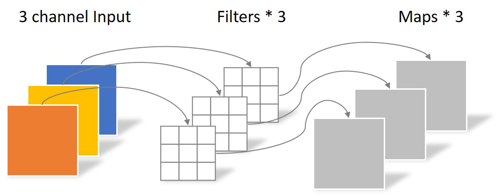
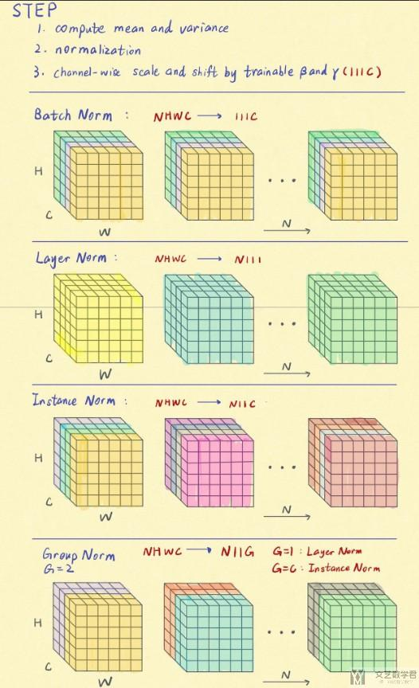
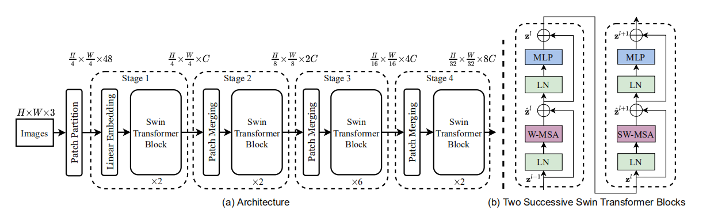
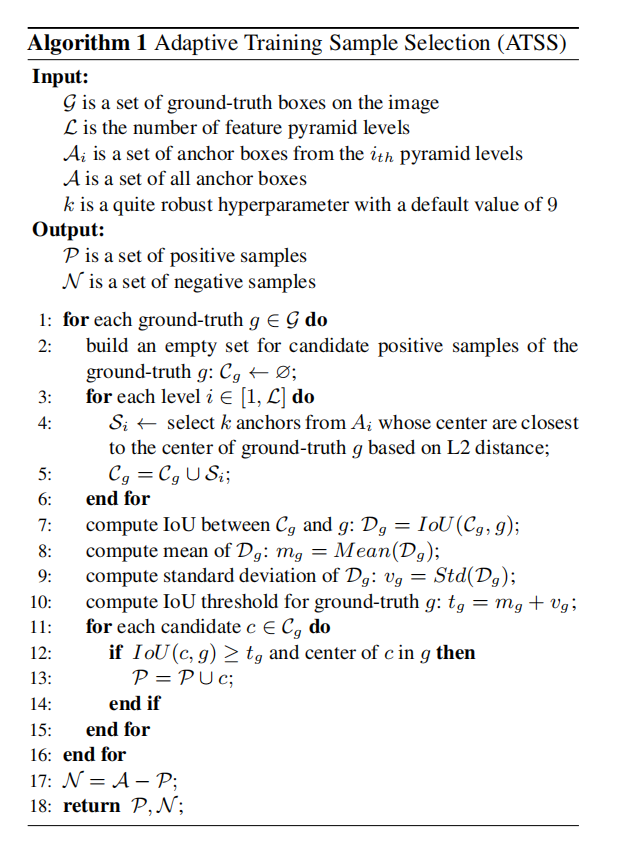
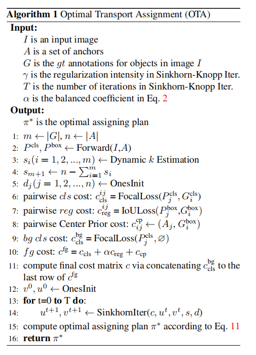

# 目标检测

[toc]

## 1.模型
模型是目标检测的核心。首先是模型中常用的一些模块（层），如卷积，激活函数。然后我们再分析网络结构，也就是这些组件如何构成整个网络。
从大的结构角度看，传统上的目标检测模型基本可以分解为backbone + neck + head。
backbone可以理解为特征提取网络，图像数据输入，经过backbone之后，我们可以得到不同尺度的特征（通常是输入尺寸的1/8,1/16,1/32三个尺度）。
neck部分做的是不同尺度的特征融合，因为不同尺度的特征关注的信息是不同的，将全局和局部信息融合可以得到更准确的结果，融合之后输出的依然是几个尺度的特征。
head即检测头，从特征得到最后的检测框信息，物体的类别和位置。

### 1.1.卷积
#### depth-wise conv
为了减少运算量，最早是在mobilenet中提出的。下面的两张图直观地反映出depth-wise conv的特点。在普通卷积中，输出的每一张特征图，都要由输入的每一张特征图经过filter之后相加得到。也就是说filter的数量为$c_{in}*c_{out}$。而在depth-wise卷积中，输出的每一张特征图，都只与输入的一张特征图对应。filter的数量减少为$c_{in}$。

#### point-wise conv
depth-wise conv由于每张输出特征图只对应一张输入特征图，因此缺少多特征之间的融合。因此，还有point-wise conv，如下图所示，即卷积核为1x1的卷积，实质上就是对特征图之间进行加权融合。point-wise conv常常用于改变通道数。同时，一个point-wise conv和一个depth-wise conv组合可以获得与一个原始convolution相同尺寸的输出，但运算量和参数量都大大减少，也被称为seperable convolution。

#### group conv
group conv则是在普通卷积和depth-wise conv之间。每一张输出的特征图，对应一个group中的几张输入特征图。当group数量等于输入通道数时，就是depth-wise conv。假设输入通道数为$c_{in}$，输出通道数为$c_{out}$，group组数为$g$。则filter数量为$(c_{in}/g) * (c_{out}/g) * g = c_{in}*c_{out}/g$。

#### dilated conv
[空洞卷积](https://arxiv.org/abs/1511.07122v3)在保持计算量相同的情况下，扩展了感受野。如下图所示，在与卷积核运算时，取点不是连续的，而是跳跃的。

#### deformable conv
[可变形卷积](https://arxiv.org/abs/1703.06211)，由于卷积核都是固定的矩形，而实际物体或特征的形状是不确定的，因此卷积提取特征时可能会有不匹配的情况。在DCN中，提出在做卷积计算下一层特征之前，先计算一组offset，以此为基准采样上一层特征中的点，再与卷积核运算得到下一层特征。计算offset同样通过卷积得到，同时由于offset不是整数，采样插值的方法来得到对应的点和数据。

### 1.2.归一化
internal covariance shift问题，由于训练过程中参数一直在更新，中间层的输出分布也一直在变化，导致模型训练不稳定。解决方法就是在模型中加入正则化，使得中间层的分布稳定，训练更稳定，收敛更快。
$$y = \frac{x - E[x]}{\sqrt{Var[x] + \epsilon}} * \gamma + \beta$$
其中，$E[x]$和$Var[x]$是均值和方差，$\epsilon$是防止除0的一个小常量，$\gamma$和$\beta$是可训练的参数。
由于我们的数据维度是[N,C,W,H]。可以在多个维度上做正则化，因此也有多种正则化。

batchnorm在NHW上做归一化，每个通道上求一个均值。
layernorm在HWC上做归一化，每个样本上求一个均值。
instancenorm在HW上做归一化，每个样本的每个通道求一个均值。
groupnorm在HWG上做归一化，每个样本的每个通道组求一个均值。当$\text{group}=1$时，就是layernorm；当$\text{group}=C$时，就是instancenorm。

### 1.3.激活函数
由于卷积运算是线性运算，为了引入非线性，我们在网络中加入激活函数。

### residual connection
[resnet](https://arxiv.org/abs/1512.03385)中提出的residual connection，在之后几乎所有网络结构中都有这一结构。

即在网络常规的一层层运算基础上，加入skip connection，跳过几层的连接。

### attention机制
attention是后面提到的transformer的核心。其实在这之前，也有不少对于attention在神经网络中的应用。attention本质上就是对于特征的权重计算和加权组合。

#### SENet
[Squeeze and Excitation Network](https://arxiv.org/abs/1709.01507)中提出的SE模块，实质上就是channel attention。通过一个global average pooling，得到1x1xC的特征，也就是每个通道一个特征值。然后通过两个FC层（通道数先降后升），之后接上一个sigmoid得到激活值（权重）。最后以这个权重乘上原始特征，调整特征。SE模块的一大优点是它本身不对特征通道形状改变，运算量也不大，可以无缝接入模型的任意位置。

#### CBAM
[Convolutional Block Attention Module](https://arxiv.org/abs/1807.06521)在SENet的基础上，又加上了spatial attention。另外在pooling时，同时用average pooling和max pooling提取两套特征，融合之后作为计算权重的特征输入。可以看到，channel attention与SENET一样，对HW维度提取，而spatial attention对C维度提取。

### neck
在backbone网络之后，我们得到的是下采样不同比例的几组特征，通过neck我们将不同比例的特征进行融合。

#### FPN
[Feature Pyramid Network](https://arxiv.org/abs/1612.03144)加入一个不断上采样的通路，将不同尺度的特征连接起来

#### PAN
[Path Aggregation Network](https://arxiv.org/abs/1803.01534)在FPN的基础上，再加入一个下采样的通路

这样，large-scale的特征可以更快的传递到small-scale的预测特征（图中的绿色通路，相比红色通路会更短，因为红色通路需要经过整个backbone网络，backbone网络层数较多）。

### anchor-based与anchor-free
anchor是目标检测中的一个重要概念。在获得物体框位置和大小时，anchor-free检测器直接对框的位置和大小进行回归，而anchor-based检测器则有所不同。anchor-based检测器事先在每个位置预设了多个anchor boxes，在回归时，我们回归的是物体框相对anchor box的位置和大小偏移。

anchor-based检测器的优点：
* 预设anchor box已经与物体框大致吻合，回归偏移量相对容易
* 同一个点可以预测多个不同物体

anchor-based检测器的缺点：
* 需要预设anchor box，通常是根据训练集中的物体框分布统计得到。一旦实际使用中，物体框的分布发生变化，会影响检测效果
* 设计较为繁琐，不符合直觉

### SPP
[Spatial Pyramid Pooling](https://arxiv.org/abs/1406.4729)，以不同的kernel size对特征图做max_pooling，然后将得到的小块特征做串联，得到融合之后的特征。本身提出时，是为了解决固定大小特征图和物体大小不匹配（crop或warp）问题，将不同大小的特征处理成固定大小的特征。后来的使用中，更多的是作为提取融合多尺度特征的一个模块，在yolov4，yolov5中都有使用。

### heatmap detector
#### CenterNet

### two-stage detector
二阶段检测器，把目标检测分为两步
* 第一步中，找出大量proposal框，其位置不准确，同时可能包含大量FP
* 第二步，根据第一步得到的每个框提取其特征，过滤掉FP，得到更准确的位置以及类别

#### ROI pooling
two-stage detector的第一步中，我们得到了proposal框的位置，根据位置，我们可以从输出的特征图上得到对应的位置。然而，由于框的大小都不统一，不方便进行后续的计算。因此，我们需要一个模块来将大小不一的proposal框从特征图上得到统一大小的特征。ROI pooling就是起到这个作用。

根据要求特征图大小，划分上一步输出的特征图，然后在每个划分区域中用max_pooling提取一个特征值。

#### ROI align
ROI pooling中有两处近似操作，对结果的准确性有一定影响。
* 由于输出特征图是在原图基础上下采样32倍，proposal框对应特征位置不是整数
* 划分区域时，不能整除，划分区域不均匀或不完整

因此，在[mask-rcnn](https://arxiv.org/abs/1703.06870)中提出了ROI align。在计算框位置和划分区域时都保留小数，然后在每个区域中通过双线性差值得到四个点的特征值，然后用max_pooling得到每个区域的特征值。

#### Faster Rcnn
[Faster-Rcnn](https://arxiv.org/abs/1506.01497)是在rcnn和fast-rcnn基础上优化得到，是二阶段目标检测网络的最经典的代表。

首先通过backbone提取图像特征。经过RPN得到proposal框（只包含前景背景二分类，以及检测框基于anchor的偏移）。通过roi pooling从图像特征中提取每一个proposal的特征。最后经过检测头，输出分类结果以及更准确的框位置。

### transformer
[Attention is all you need](https://arxiv.org/abs/1706.03762)发表之后，transformer模型横扫了NLP领域。但在视觉领域，transformer的应用却没有取得很好的效果，直到ViT的出现，之后大量transformer模型如雨后春笋般涌现出来。

#### multi-head self attention
transformer模型的核心就是multi-head self attention模块。[参考](https://jalammar.github.io/illustrated-transformer/)

卷积是用一个固定的卷积核，在整个特征图上做滑动窗口运算，可以看做是每个卷积核提取某种特征，具有局部性和位置不变性。而self attention则是计算输入序列之间的关联，并且根据关联度做加权，全局性更强。

#### ViT
[ViT](https://arxiv.org/abs/2010.11929)提出了简单的网络结构和设计，基本直接复用了transformer的encoder部分，在大数据集上取得了不错的效果。首先将图像切成固定大小的patch，将每个patch映射为固定长度的向量（等同于原始transformer中的input embedding）。加入position embedding（实验发现直接使用1D可训练向量）。同时，在输入序列的起始位置，加入一个learnable embedding，输出时，取该位置的输出，作为提取的图像特征向量，后面再接MLP做classification。

关于论文中提到的high-resolution情况下，对position embedding插值，[参考](https://blog.csdn.net/qq_44166630/article/details/127429697)

#### Swin Transformer
[Swin Transformer](https://arxiv.org/abs/2103.14030)设计了多尺度的结构，使得transformer也可以输出多尺度特征，无缝对接下游的检测分割等任务。由于小patch，多窗口的运算量极大，提出了window multihead self attention，只在局部的window内计算attention，极大地加快了运算速度。如果每层的window都是固定的话，特征信息只能在窗口内传递，因此又设计了shift window机制，使得信息可以在窗口之间交换。

作者还提出了一种快速计算shifted window attention的方法，[参考](https://github.com/microsoft/Swin-Transformer/issues/38)

另外在计算attention时，加入了一个relative position bias项
$$\text{Attention}(Q,K,V) = \text{Softmax}(\frac{QK^T}{\sqrt{d}} + B)V$$
其计算方式[参考](https://blog.csdn.net/qq_37541097/article/details/121119988)

#### DETR
之前的transformer依然没有走出传统的目标检测套路，只是将检测模型的backbone部分替换为了transformer的encoder部分。[DETR](https://arxiv.org/abs/2005.12872)则完全改变了目标检测的方法，提出了全新的结构，不再依赖anchor，而是直接预测物体。

经过cnn网络提取特征之后，加入position embedding之后输入encoder，这一部分与之前的设计基本一致。但之后，detr接了一个decoder，输入可训练的object queries作为输入embedding，同时将encoder提取的特征也输入。每一个object query经过decoder，输出一个物体目标的特征，经过一个MLP得到物体的位置和类别（包含一个no object类别以处理背景）。

由于是直接通过object query预测物体，object query的数量要设为大于可能的物体数量的一个定值$N$。在训练时，需要建立GT和预测query之间的一一对应关系。作者使用Hungarian算法来做bipartite matching，因此需要定义一个GT与预测之间的cost函数。
$$\mathbb{1}$$

## 2.损失函数
在目标检测模型训练中，主要有三个输出需要损失函数。第一个是对物体类别的预测；第二个是对检测框位置和大小的预测；第三个是某个anchor或位置是物体还是background的预测。当然，这只是比较常见的几种，实际上由于网络设计上的不同，输出的内容也可能不同，此时需要的损失函数也会不同。

### 交叉熵
交叉熵是最常用的分类损失函数。
$$CE\_Loss = -\sum_{i=0}^{C-1} y_i \log(p_i) = -\log(p_c)$$
$C$是类别数，$y=[y_0,\dots,y_{C-1}]$是类别真值标签，one-hot encoding形式。$p=[p_0,\dots,p_{C-1}]$是预测的物体类别标签，各类的概率。

### focal loss
focal loss是在交叉熵的基础上，为了解决正负样本不均衡（或类别之间不均衡）的问题而设计的。由何恺明团队在[retinanet](https://arxiv.org/abs/1708.02002)中提出。

**二分类**
$$p_t = \left\{\begin{aligned} p \quad &\text{if } y=1 \\ 1-p \quad &\text{otherwise} \end{aligned}\right.$$
$$FL = -\alpha_t(1-p_t)^{\gamma}\log(p_t)$$
$(1-p_t)^{\gamma}$的存在会使得占据数据大部分的简单样本的影响减小，而难例则影响变大。而$\alpha$参数可以调节正负样本之间的权重，缓解样本不均衡问题。

**多分类**
这里多分类的focal loss，个人认为有争议，可以有两种定义方法。

第一种是对多分类的每一种类别用二分类focal loss计算，对输出的C个类别预测score，先经过sigmoid，然后对每个类别分别以二分类focal loss公式计算。就我看到的大部分实际使用focal loss的网络中，似乎都是这种用法，此时$\alpha$依然是调节正负样本的不均衡。

第二种是在多分类交叉熵的基础上以focal loss的方式计算，对输出的C个类别预测score，先经过softmax，然后对所有类别以focal loss公式计算。此时$\alpha$是调节不同类别的不均衡。

### GFL
[generalized focal loss](https://arxiv.org/abs/2006.04388)包含了两部分，QFL和DFL。

**QFL**
前面已经提到过，在目标检测模型中，一般有三个输出，类别的预测、检测框位置、objectness score。在计算检测物体的最终置信度得分时，往往会将预测类别概率最大的概率值和objectness score相乘，得到IOU score，来做后面的NMS等等。由于这两个部分是由两个独立的检测头预测，同时，objectness score的训练往往只有正样本监督而忽略负样本。这导致训练和推理过程中，IOU score不一致，进而影响推理结果。

为了解决这一问题，作者设计了QFL，将类别预测输出和objectness score直接合并为一个输出，监督的真值为原来的类别one-hot encoding标签的基础上，乘上预测框和gt框的IOU值。这一输出可以直接用作IOU score。公式为
$$QFL(\sigma) = -|y-\sigma|^{\beta}((1-y)\log(1-\sigma)+y\log(\sigma))$$
其中$\sigma$是经过sigmoid的预测值，$y$是标签值。

**DFL**
传统的检测框位置输出，预测的是一个Dirac delta分布，即偏移量，宽高都是一个确定值。而实际场景中，由于遮挡，模糊等原因，有些物体的边界位置并不确定。DFL在预测检测框时，并不预测值而是预测一个分布，同时为了方便计算，将连续的分布转换成离散表示（按固定间隔划分）。为了训练这个检测头，设计了DFL。以标注的位置为真值中心，找到左右临近的两个值，使得他们的概率分布计算出的位置值，接近标注的gt值。公式定义如下
$$DFL(S_i,S_{i+1}) = -((y_{i+1}-y)\log(S_i)+(y-y_i)\log(S_{i+1}))$$
其中$y$是标注的位置值，$y_i \leq y \leq y_{i+1}$，$y_i$和$y_{i+1}$是临近的两个预设值。$S_k = p(y_k)$，$1 = \sum S_k$，可以由输出的预设点概率预测输出经过softmax得到。

### IOU loss
对于检测框位置输出的监督训练，最常用的损失函数为IOU loss。顾名思义，IOU loss，就是计算预测的检测框和检测框位置真值的IOU来作为损失函数。
$$IOU = \frac{|A \cap B|}{|A \cup B|}$$
$$IOU\_Loss = 1 - IOU$$

然而，IOU loss本身有它的问题
* 只要两个框不相交，则IOU为0，无法区分其接近程度
* IOU值有时不能正确反映出框的吻合程度

因此，有人对IOU loss进行了优化和修改

**GIOU**
定义包含两个框的最小外接框$C$，
$$GIOU = IOU - \frac{|C \backslash (A \cup B)|}{|C|}$$

**DIOU**
定义两框中心的距离为$\rho(A,B)$，包含两框的最小外接框的对角线距离$c$

$$DIOU = IOU - \frac{\rho^2(A,B)}{c^2}$$

## 数据增强

### 多图混合

**MixUp**

**Cutout**

**CutMix**

**Mosaic**

## 正负样本分配
目标检测网络的训练时，需要将GT对应到anchor上，分配每个anchor作为正样本或负样本。不同的分配策略对训练结果也有很大的影响。
### 分配依据
常见的分配依据包括：
* 检测框与GT的IOU
* anchor中心在GT框内
* 检测框的置信度

### OHEM
[Online Hard Example Mining](https://arxiv.org/abs/1604.03540)，意在通过加强难例，忽略简单的样本，来解决正负样本不均衡问题，尤其对于二阶段网络。

对于通过RPN得到的proposals，计算loss，根据loss降序排列，选取难例来作为训练的样本。同时做NMS来防止重复。

### ATSS
[ATSS](https://arxiv.org/abs/1912.02424)，在这篇论文中，作者通过实验论证了，anchor-based和anchor-free模型的效果差距其实来源于训练中对正负样本的分配策略不同。他们提出了一种新的正负样本分配策略。下图是ATSS算法。

对每个GT
* 在每一个尺度上（假设有$L$个尺度），计算所有anchor中心与GT中心的L2距离，取$k$个最接近的anchor
* 对这$k*L$个anchor，计算他们对应的检测框与GT的IOU，并计算IOU值的均值$m_g$与标准差$v_g$
* 以$t_g=m_g+v_g$作为阈值，筛选所有IOU大于$t_g$的anchor作为正样本
* 其余作为负样本

ATSS的优点，一是基本没有预设参数，适应性较强；二是通过均值加标准差的设计，对不同的IOU分布都有不错的效果，如下图所示

### OTA
[OTA](https://arxiv.org/abs/2103.14259)将正负样本分配转化为了一个Optimal Transport问题，然后通过Sinkhorn-Knopp迭代算法得到问题的解。

假设有$m$个GT，作为提供者，每个GT提供$s_i$个正样本标签；

有$n$个anchor，作为消费者，每个anchor可以接收1个正或负样本；

因为提供和消费的标签数应当相等。另外引入一个background作为负样本标签的提供者，它提供$n-\sum(s_i)$个负样本标签。

接着，只要定义好每个提供者与消费者之间的cost，就可以用Sinkhorn-Knopp算法来求解这个OT问题了。

对于正样本标签的cost，用对应预测框的cls和reg的加权loss，来作为损失
$$c_{ij}^{fg} = L_{cls}(P_j^{cls}(\theta),G_i^{cls}) + \alpha L_{reg}(P_j^{box}(\theta),G_i^{box})$$

对于负样本标签的cost，用对应预测框的cls背景类预测loss，来作为损失
$$c_{j}^{bg} = L_{cls}(P_j^{cls}(\theta),\emptyset)$$

对于正样本标签，另外引入一个中心先验，来限制使得只有GT中心附近的anchor更容易被分配到正样本，这样可以使训练更稳定。对每个尺度，除了$r^2$个最接近GT中心的anchor，对其他anchor加上一项额外的常数cost惩罚$c_{cp}$，这样
$$c^{fg} = c_{cls} + \alpha c_{reg} + c_{cp}$$

有了以上定义，就可以用Sinkhorn-Knopp算法来解出样本分配的结果。

## 训练策略
### optimizer
[optimizer](https://www.ruder.io/optimizing-gradient-descent/)

### warmup

## 其他trick

### 合并convolution与batchnorm
在训练完成后，推理阶段，我们可以将模型中的卷积和batchnorm合并成一个卷积，以加速推理。
$$\begin{align} F_1 &= W_{conv}F_0 + b_{conv} \\ F_2 &= W_{bn}F_1 + b_{bn} \\ F_2 &= (W_{bn}W_{conv})F_0 + (W_{bn}b_{conv} + b_n) \end{align}$$

### Reparameterization
[RepVGG](https://arxiv.org/abs/2101.03697)提出，在训练阶段保留复杂的residual connection，在推理阶段，可以将其合并为一个卷积运算。

